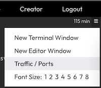

You will see two different versions of our application, running as deployments in our Kubernetes cluster.

List the deployments with the command `k get deploy`{{exec}}

The output should look similar to the following:

```bash
NAME                  READY   UP-TO-DATE   AVAILABLE   AGE
hello-java-blue-v1    3/3     3            3           70s
hello-java-green-v2   3/3     3            3           70s
```

These two apps are exposed via two different services in Kubernetes.

List the services with the command `k get svc`{{exec}}

The output should look similar to the following:

```bash
NAME             TYPE        CLUSTER-IP     EXTERNAL-IP   PORT(S)          AGE
kubernetes       ClusterIP   10.96.0.1      <none>        443/TCP          11d
svc-java-blue    NodePort    10.99.60.93    <none>        8080:30001/TCP   3m42s
svc-java-green   NodePort    10.97.210.25   <none>        8080:30000/TCP   3m41s
```

View the web page via the `nodePort` by clicking on the menu in the upper right, and selecting "Traffic / Ports" 


In the "Custom Ports" field, enter `30000` and click the "Access" button

The web page will appear and say "Hello Blue"

___
## CHALLENGE

Use the `kubectl top` command to view the CPU and memory usage for the other node in the cluster.

<br>
<details><summary>Solution</summary>
<br>

```plain
# get the name of the second node in the cluster
k get no
```{{exec}}

```plain
# show the metrics for the node named node01
k top no node01
```{{exec}}

The output should look similar to the following:
```bash
NAME     CPU(cores)   CPU%   MEMORY(bytes)   MEMORY%   
node01   40m          4%     707Mi           37%
```

</details>